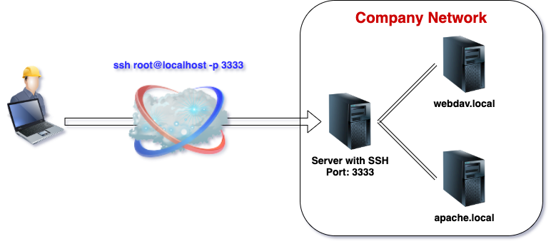

# ssh-tunnel-example

This is a very simple example of testing the basics of tunneling with SSH.
The docker compose file can be used to create a testing environment, which exists of the following network infrastructure components:

1. An encapsulated network where machines know each other... provided by docker-compose
1. A server that serves as sshd. The port 22 is exposed via docker to port **3333**
   * Exposed Port: 3333
   * User: root
   * PW: root
2. A WebDav-Server
   * Name: webdav.local
   * Port: 80
   * Login: admin
   * PW: admin
3. An Apache-Webserver
   * Name: apache.local
   * Port: 80



# Examples
## Start docker environment
```Bash
cd ./docker
docker-compose up
```
## Simple connect to your SSH-server
Test you connection to the SSH-Server... Password is 'root'
```Bash
ssh root@localhost -p 3333
```
## **L**ocal Port-Forwarding
We can use local port forwarding in order to forward a local port to a remote machine via our SSH connection! In our example we would like to use the local port 8080 and forward it to port 80 of apache.local.
How does it work:

```Bash
ssh -L 8080:apache.local:80 root@localhost -p 3333
```
Go to you browser and open: http://localhost:8080 ... you should see "It works" in your browser

## **R**everse Port-Forwarding
Imagine, you have a Keycloak running on your local machine: http://localhost:8090 And you want to access it from your SSH-Server...

We can use reverse port forwarding in order to forward a remote port to our local machine via our SSH connection! In our example we would like to use the remote port 8080 and forward it to port 8090 of our machine, where the Keycloack is running
How does it work:

```Bash
ssh -R 8080:localhost:8090 root@localhost -p 3333
```
Now connect to your SSH-Server...
```Bash
ssh root@localhost -p 3333
wget http://localhost:8080/auth
```
You should see, that the startpage of Keycloack will be downloaded!

## **D**ynamic Port Forwarding (SOCKS5-Proxy)
You can use your SSH-Server as a SOCKS5-PROXY, which forwards UDP/TCP requests dynamically.
```Bash
ssh -D 5544 root@localhost -p 3333
```
This cmd opens a SOCKS5-Proxy on port 5544. Now you can configure this proxy in different applications. E.g. Use **Proxy SwitchyOmega** (chrome://extensions/?id=padekgcemlokbadohgkifijomclgjgif)

Now you can configure in this Chrome Plugin the SOCKS5-Proxy: localhost:5544
Create A Swtich, that forwards all URLs ending with ".local" to that proxy!

Go to you browser and open:
* http://webdav.local
* http://apache.local

This example works, because in our docker-compse file the hostnames were set to these names!

Have Fun :)